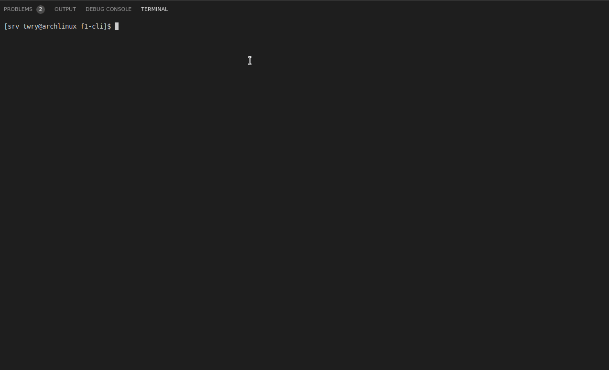

# F1-CLI

A CLI for techies who love Formula 1. The tool is written in **Go** and makes use of the following tools and APIs: 
1. [Cobra](https://github.com/spf13/cobra)
2. [Ergast Developer API](http://ergast.com/mrd/)
3. [Viper](https://github.com/spf13/viper)

## Demo

## Features
- Check the F1 schedule of an year: `schedule -y {year}`. Eg: `schedule -y 2018` will print the complete schedule of 2018 Formula 1 season.
- Check the F1 schedule of a particular race of an year: `schedule -y {year} -r {round_number}`. Eg: `schedule -y 2018 -r 4` will print the schedule of 2018 Azerbaijan Grand Prix. 

## Development
This project uses [go modules](https://blog.golang.org/using-go-modules) and hence it's not necessary to download the project in `$GOPATH`.

In order to contribute to this project please go through the following steps:
- Fork the repository.
- Run `git clone https://github.com/{your_username}/f1-cli` locally to pull the repo.
- Run `go build` to build the module. This will create an executable named `f1-cli`.
- Run the cli using `./f1-cli`. Enjoy!

## Future Plans
- [x] Schedule of a f1 season.
- [x] Schedule of a particular race of a year. 
- [ ] Race results.
- [ ] Drivers Standings
- [ ] Constructors Standings
- [ ] Driver Information
- [ ] Constructor Information

Liked it? :heart_eyes: Leave a star! :star: